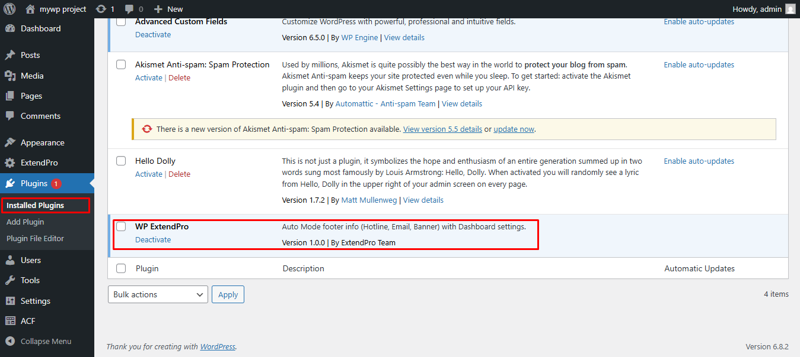
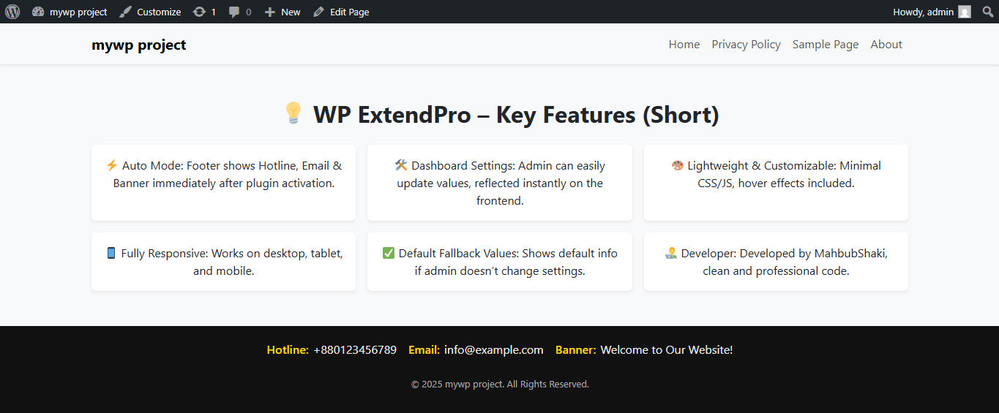
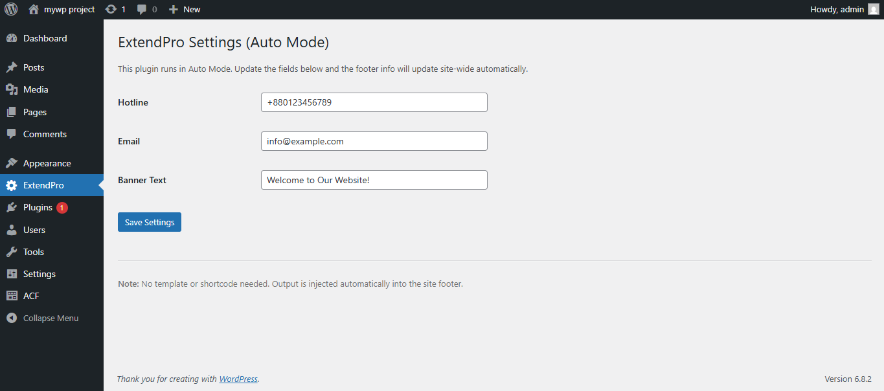

# 🎉 WP ExtendPro

[](https://wordpress.org/)
[](https://www.php.net/)
[](https://www.gnu.org/licenses/gpl-2.0.html)

**Contributors:** MahbubShaki  
**Tags:** wordpress, plugin, footer, auto mode, settings, admin  
**Requires at least:** 6.0  
**Tested up to:** 6.5  
**Stable tag:** 1.0.0  
**License:** GPLv2 or later  

---

## 📌 Description

WP ExtendPro is a lightweight, plug-and-play WordPress plugin that adds a dynamic footer with **Hotline, Email, and Banner text**.

✨ **Features:**
- ⚡ **Auto Mode** → Default values show instantly after plugin activation.
- 🛠️ **Dashboard Settings** → Admin can edit Hotline, Email, Banner text easily.
- 🎨 Clean and lightweight code with minimal inline CSS.
- 📱 Fully responsive footer design.
- 📝 Ready for templates and further customization.

---

## 📹 Live Video Demo

Watch a live demo of WP ExtendPro in action: [Live Video Demo](assets/demo/wp-extendpro-demo.gif)  
*(Click the link to see Auto Mode + Dashboard Settings working live)*

---
```text
wp-extendpro/                          # Main plugin folder
│
├─ assets/                             # Frontend static files (CSS, JS, Images, Demo)
│   ├─ css/
│   │   ├─ admin-style.css             # Admin dashboard stylesheet
│   │   └─ frontend-style.css          # Plugin frontend stylesheet
│   │
│   ├─ js/
│   │   └─ admin-script.js             # Plugin frontend JavaScript
│   │
│   ├─ images/                         # Screenshots / Preview Images
│   │   ├─ admin-settings.png          # Screenshot of Admin Settings Page (Dashboard UI)
│   │   ├─ auto-footer.png             # Preview of Auto Footer mode
│   │   └─ custom-footer.png           # Preview of Custom Footer mode
│   │
│   └─ demo/
│       └─ demo-video.mp4              # Demo video showcasing the plugin functionality
│
├─ includes/
│   ├─ class-admin.php                 # Admin Dashboard logic
│   ├─ class-front.php                 # Frontend Auto Footer logic (Lite/Basic)
│   ├─ class-extendpro-front.php       # Frontend Auto Footer logic (Full/Pro)
│   └─ functions.php                   # Additional helper functions
│
├─ languages/
│   └─ wp-extendpro.pot                # Translation template file (i18n/l10n)
│
├─ templates/
│   └─ my-template.php                 # Frontend template for features shortcode/section
│
├─ wp-extendpro.php                     # Main plugin bootstrap file (loads classes & hooks)
├─ uninstall.php                        # Uninstall script (cleans up plugin data)
└─ README.md                            # Plugin documentation (GitHub/WordPress.org details)

```
---

## 🚀 Installation

1. Upload the `wp-extendpro` folder to the `/wp-content/plugins/` directory.  
2. Activate the plugin through the 'Plugins' menu in WordPress.  
3. (Optional) Go to Dashboard → Settings → ExtendPro Settings to customize Hotline, Email, and Banner Text.  
4. Visit your website footer to see it in action. ✅

---

## ❓ Frequently Asked Questions (FAQ)

**Q:** Will this plugin work without configuring anything?  
**A:** Yes! Auto Mode ensures the footer shows default values immediately after activation. 👍

**Q:** Can I change the content later?  
**A:** Absolutely. Go to **Settings → ExtendPro Settings** in your dashboard to update values. ✏️

**Q:** Is it lightweight?  
**A:** Yes. Only essential CSS and JS are loaded, minimal impact on page speed. 🚀

---

## 🖼️ Screenshots

### 1️⃣ Admin Settings Page
Shows the Dashboard UI where you can update Hotline, Email, and Banner text.


---

### 2️⃣ Auto Footer Mode
Demo of the automatic footer injected via Auto Mode.


---

### 3️⃣ Custom Footer Example
Example of how the footer can appear when customized.



---

## 📜 Changelog

### 1.0.0
* ✅ Initial release with Auto Mode + Dashboard Settings Page  
* 📞 Default values for Hotline, Email, Banner  
* 📱 Fully responsive footer with minimal CSS  
* ✨ Hover effects for labels and items  

---

## ⚠️ Upgrade Notice

Initial release. Make sure to test on a staging site before activating on production.

---

## 🧑‍💻 Developer

**MahbubShaki**  
Upwork Profile: [https://upwork.com/freelancers/~015df70a23d7f58180](https://upwork.com/freelancers/~015df70a23d7f58180)  
Email: mahbubshaki64@gmail.com

# wp-extendpro
WP ExtendPro is a lightweight WordPress plugin that adds a dynamic footer with Hotline, Email, and Banner text. Features Auto Mode, Dashboard Settings, fully responsive design, and minimal code for easy customization.

